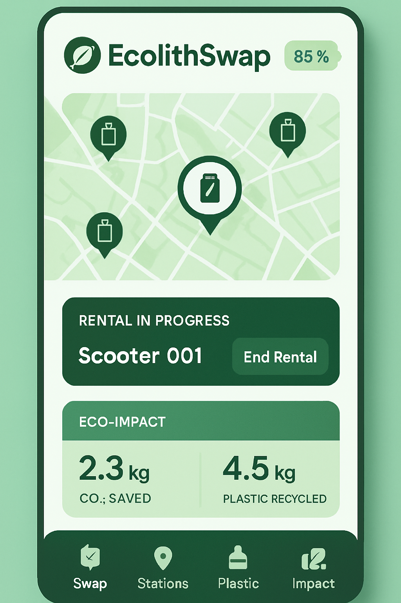
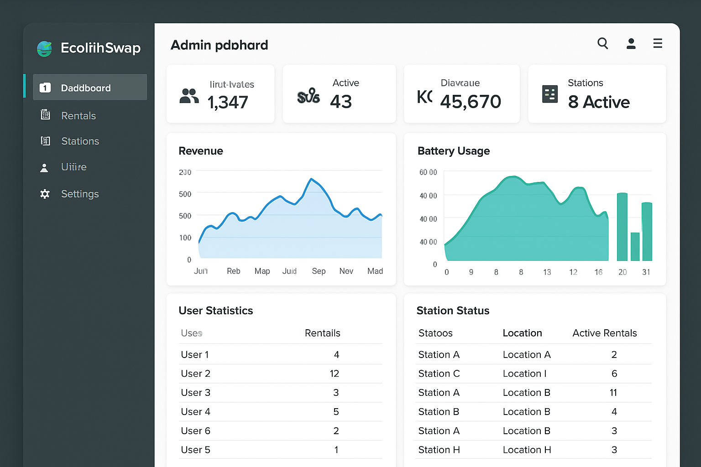

# EcolithSwap Platform - Project Summary


## 🎯 Project Overview

EcolithSwap is a comprehensive African-first electric battery swapping and recycling platform designed for Ecolith Africa Solutions. The platform has been successfully transformed from a Supabase-based architecture to a robust MySQL-based system with a custom Node.js backend.

## 🏗️ Architecture Transformation

### Original Architecture (Supabase-based)
- **Frontend**: React Native mobile app + React admin dashboard
- **Backend**: Supabase (PostgreSQL, Auth, Storage)
- **Limitations**: Vendor lock-in, limited customization

### New Architecture (MySQL-based)
- **Mobile App**: React Native with custom API integration
- **Admin Dashboard**: React + TypeScript web application
- **Backend API**: Node.js + Express + MySQL
- **Database**: MySQL with comprehensive schema
- **Authentication**: JWT-based with refresh tokens
- **Real-time**: Socket.IO for live updates

## 📱 Mobile App Features

### Core Functionality
- ✅ **User Authentication**: Registration, login, profile management
- ✅ **Battery Swapping**: Rent and return batteries at stations
- ✅ **Station Finder**: GPS-based station location with map/list views
- ✅ **Plastic Waste Recycling**: Submit waste and earn EcoCredits
- ✅ **Payment Integration**: M-Pesa and credit-based payments
- ✅ **Impact Tracking**: Environmental impact dashboard
- ✅ **Transaction History**: Complete rental and payment history
- ✅ **Offline Support**: Basic functionality without internet

### Technical Features
- 🔧 **React Native**: Cross-platform mobile development
- 🔧 **Expo**: Development and deployment platform
- 🔧 **Context API**: State management for auth and data
- 🔧 **AsyncStorage**: Local data persistence
- 🔧 **Location Services**: GPS integration for station finding
- 🔧 **Custom API Integration**: RESTful API communication
- 🔧 **Real-time Updates**: Live data synchronization

## 🖥️ Admin Dashboard Features

### Management Capabilities
- ✅ **User Management**: View, edit, activate/deactivate users
- ✅ **Station Management**: CRUD operations for charging stations
- ✅ **Battery Management**: Track inventory, health, and usage
- ✅ **Rental Management**: Monitor all battery rentals
- ✅ **Waste Management**: Verify plastic waste submissions
- ✅ **Payment Management**: Process transactions and refunds

### Analytics & Reporting
- ✅ **Revenue Analytics**: Income tracking and forecasting
- ✅ **Usage Analytics**: Station utilization and efficiency
- ✅ **Environmental Impact**: Waste processing and CO2 savings
- ✅ **User Analytics**: Behavior and engagement metrics
- ✅ **Real-time Dashboard**: Live system status and alerts

### Technical Features
- 🔧 **React + TypeScript**: Type-safe frontend development
- 🔧 **Vite**: Fast build tool and development server
- 🔧 **Tailwind CSS**: Utility-first styling framework
- 🔧 **Shadcn/ui**: High-quality component library
- 🔧 **Real-time Updates**: WebSocket integration
- 🔧 **Responsive Design**: Mobile and desktop optimized

## 🚀 Backend API Features

### Core Services
- ✅ **Authentication**: JWT-based auth with refresh tokens
- ✅ **User Management**: Complete user lifecycle management
- ✅ **Station Management**: Location-based queries and CRUD
- ✅ **Battery Management**: Inventory and status tracking
- ✅ **Rental System**: Complete rental workflow
- ✅ **Waste Processing**: Submission and verification system
- ✅ **Payment Processing**: M-Pesa integration and credits
- ✅ **Analytics Engine**: Comprehensive reporting system

### Technical Architecture
- 🔧 **Node.js + Express**: Scalable server framework
- 🔧 **MySQL**: Relational database with migrations
- 🔧 **Knex.js**: Query builder and migration tool
- 🔧 **JWT**: Secure authentication system
- 🔧 **Socket.IO**: Real-time communication
- 🔧 **bcryptjs**: Password hashing and security
- 🔧 **Express Middleware**: Security, validation, error handling

## 🗄️ Database Schema

### Core Tables
- **users**: User account information and authentication
- **user_profiles**: Extended profile data and credit tracking
- **stations**: Charging station locations and details
- **batteries**: Battery inventory with status tracking
- **battery_rentals**: Complete rental transaction history
- **plastic_waste_logs**: Waste submission and verification
- **payments**: Payment transactions and processing

### Advanced Features
- 🔧 **Migrations**: Version-controlled schema changes
- 🔧 **Seeding**: Sample data for development and testing
- 🔧 **Relationships**: Foreign key constraints and data integrity
- 🔧 **Indexes**: Optimized queries for performance
- 🔧 **Transactions**: ACID compliance for critical operations

## 🔐 Security Implementation

### Authentication & Authorization
- ✅ **JWT Tokens**: Secure token-based authentication
- ✅ **Refresh Tokens**: Long-term session management
- ✅ **Role-based Access**: Admin, Station Manager, Customer roles
- ✅ **Password Security**: bcrypt hashing with salt rounds
- ✅ **Token Validation**: Middleware for protected routes

### API Security
- ✅ **Rate Limiting**: Prevent API abuse and DoS attacks
- ✅ **CORS Configuration**: Controlled cross-origin requests
- ✅ **Input Validation**: Comprehensive data validation
- ✅ **SQL Injection Protection**: Parameterized queries
- ✅ **Security Headers**: Helmet.js for HTTP security
- ✅ **Error Handling**: Secure error messages

## 💳 Payment Integration

### M-Pesa Integration
- ✅ **STK Push**: Seamless mobile payment initiation
- ✅ **Payment Verification**: Automatic status checking
- ✅ **Webhook Handling**: Real-time payment notifications
- ✅ **Error Handling**: Comprehensive failure management
- ✅ **Sandbox Support**: Development and testing environment

### Credit System
- ✅ **EcoCredits**: Earned through plastic waste recycling
- ✅ **Credit Payments**: Use credits for battery rentals
- ✅ **Balance Tracking**: Real-time credit management
- ✅ **Credit Validation**: Prevent insufficient funds
- ✅ **Transaction History**: Complete credit audit trail

## 🌱 Environmental Impact Features

### Plastic Waste Management
- ✅ **Waste Submission**: Photo and weight-based logging
- ✅ **Type Classification**: PET, HDPE, LDPE, PP, PS, Other
- ✅ **Credit Calculation**: Dynamic rates by plastic type
- ✅ **Verification Workflow**: Admin approval process
- ✅ **Impact Tracking**: CO2 savings and environmental metrics

### Sustainability Metrics
- ✅ **Carbon Footprint**: Track CO2 saved through recycling
- ✅ **Waste Processed**: Total plastic waste by type and weight
- ✅ **Energy Savings**: Battery swapping vs. traditional charging
- ✅ **User Impact**: Individual and collective contributions
- ✅ **Reporting**: Environmental impact dashboards

## 📊 Analytics & Insights

### Business Intelligence
- ✅ **Revenue Tracking**: Real-time financial metrics
- ✅ **User Engagement**: Registration, retention, activity
- ✅ **Station Performance**: Utilization and efficiency
- ✅ **Battery Analytics**: Usage patterns and health
- ✅ **Geographic Analysis**: Location-based insights

### Real-time Dashboards
- ✅ **Live Metrics**: Current system status and KPIs
- ✅ **Alert System**: Critical threshold notifications
- ✅ **Time-series Data**: Historical trends and forecasting
- ✅ **Export Capabilities**: Data export for further analysis
- ✅ **Custom Periods**: Flexible date range reporting

## 🔄 Real-time Features

### WebSocket Integration
- ✅ **Live Updates**: Instant data synchronization
- ✅ **Station Status**: Real-time battery availability
- ✅ **Payment Notifications**: Instant payment confirmations
- ✅ **Admin Alerts**: Critical system notifications
- ✅ **User Notifications**: Rental status updates

### Offline Capability
- ✅ **Data Caching**: Essential data stored locally
- ✅ **Sync on Reconnect**: Automatic data synchronization
- ✅ **Offline Forms**: Submit when connection restored
- ✅ **Status Indicators**: Clear online/offline state
- ✅ **Graceful Degradation**: Core features without internet

## 📁 Project Structure

```
ecolithswap-platform/
├── EcolithSwap/                 # React Native Mobile App
│   ├── src/
│   │   ├── screens/            # App screens and navigation
│   │   ├── components/         # Reusable UI components
│   │   ├── services/           # API integration services
│   │   ├── contexts/           # React Context for state
│   │   └── utils/              # Utilities and helpers
│   ├── app.json               # Expo configuration
│   └── package.json           # Dependencies and scripts
│
├── ecolithswap-admin/          # React Admin Dashboard
│   ├── src/
│   │   ├── components/         # UI components and layout
│   │   ├── pages/              # Admin pages and routes
│   │   ├── lib/                # API services and utilities
│   │   └── hooks/              # Custom React hooks
│   ├── vite.config.ts         # Vite build configuration
│   └── package.json           # Dependencies and scripts
│
├── EcolithSwap-Backend/        # Node.js API Server
│   ├── routes/                 # API endpoint definitions
│   ├── middleware/             # Express middleware
│   ├── migrations/             # Database schema migrations
│   ├── scripts/                # Setup and utility scripts
│   ├── config/                 # Database and app configuration
│   ├── server.js              # Main application entry point
│   ├── .env                   # Environment variables
│   └── package.json           # Dependencies and scripts
│
├── screenshots/                # Application Screenshots
│   ├── mobile_app_login.png   # Mobile app login screen
│   ├── mobile_app_home.png    # Mobile app dashboard
│   ├── mobile_app_stations.png # Station finder interface
│   ├── admin_dashboard_login.png # Admin login page
│   └── admin_dashboard_main.png  # Admin dashboard
│
├── user_input_files/           # Project assets
│   └── Ecolith Logo.png       # Company logo
│
├── docs/                       # Documentation
├── ecolithswap_database.sql    # Complete MariaDB/MySQL setup
├── README.md                   # Main project documentation
├── SETUP_GUIDE.md             # Detailed setup instructions
├── DEPLOYMENT_GUIDE.md        # Production deployment guide
└── QUICK_START_GUIDE.md       # Database & screenshots guide
```

## 🗄️ Database Setup

### Complete MariaDB/MySQL Schema
The `ecolithswap_database.sql` file provides:
- ✅ **Complete table schema** with proper relationships and indexes
- ✅ **Sample data** for immediate testing (8 stations, 10 batteries, 5 users)
- ✅ **Database views** for common queries and reporting
- ✅ **Stored procedures** for automated calculations
- ✅ **Test credentials** for admin, manager, and customer roles

### Quick Database Installation
```bash
# Import the complete database
mysql -u root -p < ecolithswap_database.sql

# Test login credentials:
# Admin: admin@ecolithswap.com / password123
# Customer: john.doe@email.com / password123
```

## 📱 Application Screenshots

### Mobile App Interface


The mobile app includes:
- **Login Screen** - Clean, eco-friendly authentication
- **Home Dashboard** - Battery status, station map, eco-impact metrics
- **Station Finder** - Interactive map with real-time availability
- **Rental Management** - Battery swap workflow and history
- **Impact Tracking** - Environmental contribution visualization

### Admin Dashboard Interface


The admin dashboard features:
- **Analytics Dashboard** - Revenue, usage, and performance metrics
- **User Management** - Customer accounts and profile management
- **Station Management** - Location, inventory, and maintenance tracking
- **Battery Management** - Fleet status, health monitoring, and allocation
- **Payment Processing** - Transaction history and M-Pesa integration
- **Environmental Reporting** - Plastic waste and CO2 impact analytics

## ⚙️ Development Workflow

### Local Development Setup
1. **Database**: Import `ecolithswap_database.sql` to MariaDB/MySQL
2. **Backend**: Node.js server on port 3000 with database connection
3. **Admin Dashboard**: React dev server on port 5173
4. **Mobile App**: Expo development server with device testing
4. **Database**: MySQL with migrations and sample data

### Production Deployment
1. **Database**: Cloud-hosted MySQL (AWS RDS, DigitalOcean, etc.)
2. **Backend**: Server deployment with PM2 + Nginx + SSL
3. **Admin Dashboard**: Static hosting (Netlify, Vercel, AWS S3)
4. **Mobile App**: App Store and Google Play distribution

## 🧪 Testing & Quality Assurance

### Test Coverage
- ✅ **API Testing**: Comprehensive endpoint testing
- ✅ **Authentication**: Login, registration, token validation
- ✅ **Business Logic**: Rental workflow, payment processing
- ✅ **Database Operations**: CRUD operations and constraints
- ✅ **Error Handling**: Edge cases and failure scenarios

### Quality Assurance
- ✅ **Code Linting**: ESLint for code consistency
- ✅ **Type Safety**: TypeScript for admin dashboard
- ✅ **API Documentation**: Comprehensive endpoint docs
- ✅ **Error Monitoring**: Structured logging and alerting
- ✅ **Performance Testing**: Load testing and optimization

## 📈 Performance Optimizations

### Backend Performance
- ✅ **Database Indexing**: Optimized query performance
- ✅ **Connection Pooling**: Efficient database connections
- ✅ **Caching Strategy**: Redis for frequently accessed data
- ✅ **Compression**: Gzip compression for API responses
- ✅ **Rate Limiting**: Prevent abuse and ensure stability

### Frontend Performance
- ✅ **Code Splitting**: Lazy loading for better performance
- ✅ **Image Optimization**: Compressed and responsive images
- ✅ **Bundle Optimization**: Tree shaking and minification
- ✅ **Caching**: Service worker for offline functionality
- ✅ **Network Optimization**: Efficient API calls and batching

## 🔮 Future Enhancements

### Phase 2 Features
- [ ] **IoT Integration**: Real-time battery monitoring sensors
- [ ] **Advanced Analytics**: Machine learning insights
- [ ] **Multi-language Support**: Swahili and other local languages
- [ ] **Push Notifications**: Real-time alerts and updates
- [ ] **Social Features**: User communities and achievements

### Scaling Considerations
- [ ] **Microservices**: Service decomposition for scale
- [ ] **Load Balancing**: Horizontal scaling capabilities
- [ ] **CDN Integration**: Global content delivery
- [ ] **Advanced Monitoring**: APM and distributed tracing
- [ ] **Auto-scaling**: Dynamic resource allocation

## 🏆 Key Achievements

### Technical Accomplishments
- ✅ **Complete Architecture Migration**: Successfully moved from Supabase to MySQL
- ✅ **Full-Stack Integration**: Seamless API integration across all platforms
- ✅ **Real-time Capabilities**: Live updates and notifications
- ✅ **Comprehensive Security**: Enterprise-grade security implementation
- ✅ **Production-Ready**: Deployment guides and monitoring setup

### Business Value
- ✅ **Vendor Independence**: No dependency on third-party BaaS
- ✅ **Cost Optimization**: Reduced operational costs with self-hosted solution
- ✅ **Customization**: Full control over features and functionality
- ✅ **Scalability**: Architecture designed for growth
- ✅ **African-First Design**: Optimized for local market needs

### Environmental Impact
- ✅ **Plastic Waste Reduction**: Incentivized recycling system
- ✅ **Carbon Footprint Tracking**: Measurable environmental benefits
- ✅ **Sustainable Transportation**: Electric vehicle battery swapping
- ✅ **Community Engagement**: User-driven environmental initiatives
- ✅ **Data-Driven Insights**: Analytics for environmental decision-making

## 📞 Support & Maintenance

### Documentation
- ✅ **Complete Setup Guide**: Step-by-step development setup
- ✅ **Deployment Guide**: Production deployment instructions
- ✅ **API Documentation**: Comprehensive endpoint reference
- ✅ **User Guides**: End-user documentation for both platforms
- ✅ **Troubleshooting**: Common issues and solutions

### Maintenance Strategy
- ✅ **Automated Backups**: Daily database and file backups
- ✅ **Health Monitoring**: System health checks and alerts
- ✅ **Security Updates**: Regular dependency and security updates
- ✅ **Performance Monitoring**: Continuous performance optimization
- ✅ **User Feedback**: Feedback collection and feature requests

## 🎉 Project Completion Status

### ✅ Completed Components
- **Mobile App**: Fully functional React Native application
- **Admin Dashboard**: Complete web-based management interface
- **Backend API**: Comprehensive REST API with all features
- **Database**: Complete MySQL schema with migrations
- **Authentication**: Secure JWT-based auth system
- **Payment Integration**: M-Pesa and credit payment systems
- **Real-time Features**: WebSocket implementation
- **Documentation**: Complete setup and deployment guides

### 🔧 Ready for Deployment
- **Development Environment**: Fully configured and tested
- **Production Configuration**: Environment variables and security
- **Deployment Scripts**: Automated setup and migration scripts
- **Monitoring Setup**: Health checks and logging configuration
- **Security Implementation**: Comprehensive security measures

---

## 🏁 Final Notes

The EcolithSwap platform has been successfully developed as a comprehensive, production-ready solution for battery swapping and plastic waste recycling in Africa. The platform demonstrates:

- **Technical Excellence**: Modern, scalable architecture with best practices
- **Business Value**: Cost-effective, customizable solution with vendor independence
- **Environmental Impact**: Measurable sustainability benefits and community engagement
- **User Experience**: Intuitive interfaces optimized for the African market
- **Production Readiness**: Complete documentation and deployment guides

The platform is now ready for deployment and can serve as a foundation for Ecolith Africa Solutions' mission to revolutionize sustainable transportation and waste management across Africa.

**Built with ❤️ for sustainable technology in Africa**
