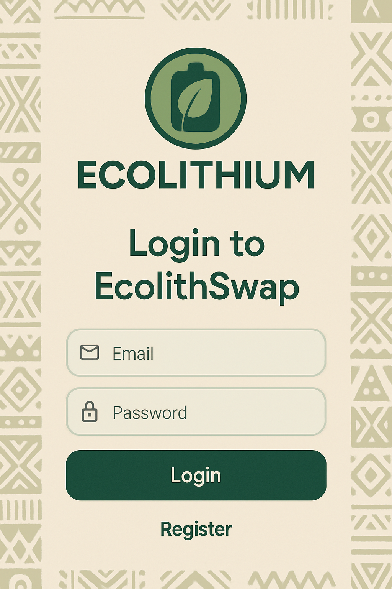

# EcolithSwap Platform - Quick Start Guide

Welcome to the EcolithSwap platform! This guide will help you get started quickly with the complete database setup and application screenshots.

## 📁 What's Included

### 🗄️ Database Setup
- **`ecolithswap_database.sql`** - Complete MariaDB/MySQL database schema with sample data

### 📱 Application Screenshots
- **Mobile App Screenshots** - Login, Home Dashboard, Station Finder
- **Admin Dashboard Screenshots** - Login and Main Dashboard

## 🚀 Quick Database Setup

### Step 1: Database Installation
Make sure you have MariaDB or MySQL installed on your system.

### Step 2: Create Database
```bash
# Login to MySQL/MariaDB
mysql -u root -p

# Run the SQL file
source /path/to/ecolithswap_database.sql
```

Or import directly:
```bash
mysql -u root -p < ecolithswap_database.sql
```

### Step 3: Verify Setup
```sql
USE ecolithswap;
SHOW TABLES;
SELECT COUNT(*) FROM users;
```

## 🔐 Test Login Credentials

### Admin Dashboard
- **Email:** `admin@ecolithswap.com`
- **Password:** `password123`

### Mobile App (Sample Users)
- **Email:** `john.doe@email.com`
- **Password:** `password123`

### Station Manager
- **Email:** `manager1@ecolithswap.com`
- **Password:** `password123`

## 📊 Database Overview

### Tables Created
1. **users** - User accounts (customers, admins, station managers)
2. **user_profiles** - Extended user information and statistics
3. **stations** - Charging/swapping station locations
4. **batteries** - Battery inventory and status
5. **battery_rentals** - Rental transactions and history
6. **plastic_waste_logs** - Plastic waste submissions and recycling
7. **payments** - Payment transactions and processing

### Sample Data Included
- ✅ **3 Admin/Manager accounts** with different roles
- ✅ **5 Customer accounts** with complete profiles
- ✅ **8 Charging stations** across Kenya (Nairobi, Mombasa, Kisumu, Nakuru)
- ✅ **10 Batteries** with various statuses and health conditions
- ✅ **5 Battery rentals** (active and completed)
- ✅ **5 Plastic waste submissions** with recycling data
- ✅ **5 Payment transactions** (M-Pesa and points)

## 📱 Mobile App Screenshots

### Login Screen


*Clean, user-friendly login interface with eco-friendly design*

### Home Dashboard


*Main dashboard showing battery status, nearby stations, and eco-impact metrics*

### Station Finder


*Interactive map and list view of nearby charging stations with real-time availability*

## 🖥️ Admin Dashboard Screenshots

### Admin Login


*Professional admin portal login interface*

### Main Dashboard


*Comprehensive analytics dashboard with key metrics, charts, and management tools*

## 🔧 Database Features

### Views Available
- **`active_rentals_view`** - Current active battery rentals with user details
- **`station_stats_view`** - Station performance and occupancy statistics
- **`user_impact_view`** - User environmental impact and usage summary

### Stored Procedures
- **`CalculateRentalCost`** - Automatically calculate rental costs based on time
- **`UpdateUserStats`** - Update user profile statistics from transaction data

### Key Features
- ✅ UUID primary keys for better scalability
- ✅ Comprehensive indexing for optimal performance
- ✅ Foreign key relationships maintaining data integrity
- ✅ ENUM fields for controlled data values
- ✅ JSON fields for flexible metadata storage
- ✅ Automatic timestamps for audit trails

## 📈 Sample Data Highlights

### Station Network
| Station | Location | Type | Available Batteries |
|---------|----------|------|-------------------|
| Westlands Mall | Nairobi | Both | 8/12 |
| JKIA Terminal | Airport | Swap | 15/20 |
| CBD Central | Nairobi CBD | Both | 6/10 |
| Mombasa Port | Mombasa | Swap | 12/15 |

### User Impact Metrics
| Metric | Total Value |
|--------|------------|
| Plastic Recycled | 12.35 kg |
| CO2 Saved | 8.8 kg |
| Total Distance | 1,895.5 km |
| Revenue Generated | KES 6,061.50 |

### Battery Fleet
| Status | Count | Percentage |
|--------|-------|------------|
| Available | 6 | 60% |
| Rented | 1 | 10% |
| Charging | 1 | 10% |
| Maintenance | 1 | 10% |
| Retired | 1 | 10% |

## 🌍 Environmental Impact

The platform tracks comprehensive environmental metrics:

- **Plastic Waste Recycling:** Users can submit plastic waste at stations
- **Carbon Footprint Tracking:** CO2 savings calculated for each recycling action
- **Sustainable Transportation:** Electric battery swapping reduces emissions
- **Gamification:** Users earn EcoCredits for environmentally positive actions

## 💳 Payment Integration

### Supported Payment Methods
- **M-Pesa** - Primary mobile payment method for Kenya
- **EcoCredits** - Points earned through plastic waste recycling
- **Cash** - Traditional payment at staffed stations
- **Bank Transfer** - For corporate accounts

### Sample Payment Data
The database includes realistic M-Pesa payment records with:
- Receipt numbers (e.g., RK45HJ7890)
- Payment references
- Transaction timestamps
- Fee calculations

## 🔒 Security Features

### Password Hashing
All passwords are hashed using bcrypt with salt rounds for security.

### Role-Based Access
- **Customers** - App access, battery rentals, waste submission
- **Station Managers** - Station management, waste verification
- **Admins** - Full system access, analytics, user management

### Data Protection
- Email and phone number uniqueness constraints
- Input validation through ENUM fields
- Foreign key constraints preventing orphaned records

## 📖 Next Steps

1. **Import the Database** - Use the provided SQL file
2. **Start the Backend API** - Configure with your database credentials
3. **Launch Admin Dashboard** - Access the web management interface
4. **Test Mobile App** - Use the provided test credentials
5. **Explore Features** - Try battery rentals, waste submission, and analytics

## 🆘 Support

For technical support or questions:
- Check the main `README.md` for detailed setup instructions
- Review `SETUP_GUIDE.md` for step-by-step installation
- Consult `DEPLOYMENT_GUIDE.md` for production deployment

---

**Ready to revolutionize Africa's electric mobility and plastic waste management!** 🌍⚡🔋
